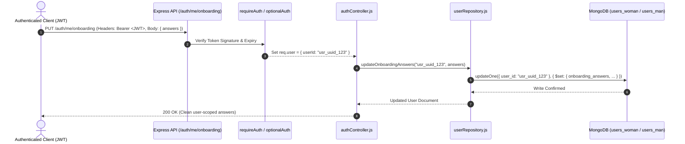

# ONBOARDING OPTION, DASHBOARD BEHAVIOR & USER-ISOLATION AUDIT REPORT

**Audit Mode:** CHECK-ONLY (Non-Modifying Source Inspection)  
**Target Codebase:** `BLUSHY_MAINAPP` (Flutter Client + Node.js/Express Backend)  
**Date:** August 25, 2026  
**Status:** Audit Completed — Awaiting User Decision & Explicit Approval  
**Security Scope:** Staging Synthetic Accounts & Static Source Code Inspection Only  

---

## 1. Executive Summary

This comprehensive audit evaluated the onboarding architecture, question branching logic, backend persistence integrity, cross-account security isolation, and dynamic dashboard synchronization across all supported life stages in the application.

### Key Audit Findings:
1. **Authenticated User-ID Persistence**: Onboarding answers are transmitted via `PUT /auth/me/onboarding` and persisted exclusively under the authenticated JWT user ID (`req.user.userId`) in MongoDB (`users_woman` or `users_man` collections). Client-supplied user IDs in request bodies are ignored.
2. **True Dynamic Question Branching**: The onboarding flow is **not fixed**. Following three universal setup steps (Name, DOB, Life Stage), the questionnaire dynamically branches into **9 distinct life-stage questionnaires** (First Period Not Started, First Period Started, Reproductive Years, Hormonal Health, Trying to Conceive, Pregnancy, Postpartum, Perimenopause, and Menopause) plus a dedicated **Partner Onboarding Flow**.
3. **Dynamic Dashboard Hydration**: User onboarding choices alter downstream dashboards, header briefs, cycle calculation modes, and Sia AI system prompts. Users who select "First Period Not Started" or "Menopause" cleanly disable cycle day numbers, while "Reproductive Years" activates ovulation calculations.
4. **Isolated Storage & Offline Queueing**: Local profile data and offline queues use user-scoped storage prefixes (`usr_<uid>_`). Account switching strictly isolates data; User B cannot read User A's cached onboarding answers or queued health extractions.
5. **Identified Overwrites & Global State Risks**:
   - `coach_first_launch.json` in [onboarding_wizard.dart:594](file:///d:/Blushyyy/Blushy/BLUSHY_MAINAPP/lib/features/auth/presentation/onboarding_wizard.dart#L594) is written as an un-namespaced root file rather than using `BlushyStorage`.
   - Date of birth has a silent fallback `'2000-01-01'` on line 472 if bypassed.

---

## 2. Onboarding Question Inventory

### Universal Baseline Questions (All Female Users)

| Question Text | File & Line | Step & Flow | Condition | Required / Optional | Allowed Values / Validation | Flutter State | Backend Endpoint | MongoDB Field |
| :--- | :--- | :--- | :--- | :--- | :--- | :--- | :--- | :--- |
| **"What should we call you?"** | [onboarding_wizard.dart:1212](file:///d:/Blushyyy/Blushy/BLUSHY_MAINAPP/lib/features/auth/presentation/onboarding_wizard.dart#L1212) | Step 1 (Universal) | Always shown | **Required** (Non-empty string) | 1–50 alphanumeric chars | `_profile.preferredName` | `PUT /auth/me/onboarding` (`preferred_name`) | `users_woman.display_name`, `onboarding_answers.preferred_name` |
| **"When were you born?"** | [onboarding_wizard.dart:1242](file:///d:/Blushyyy/Blushy/BLUSHY_MAINAPP/lib/features/auth/presentation/onboarding_wizard.dart#L1242) | Step 2 (Universal) | Always shown | **Required** (Age >= 18) | Valid `YYYY-MM-DD` | `_profile.dateOfBirth` | `PUT /auth/me/onboarding` (`date_of_birth`) | `users_woman.onboarding_answers.date_of_birth` |
| **"Which best describes your current journey?"** | [onboarding_wizard.dart:1310](file:///d:/Blushyyy/Blushy/BLUSHY_MAINAPP/lib/features/auth/presentation/onboarding_wizard.dart#L1310) | Step 3 (Universal) | Always shown | **Required** (Single select) | 9 enum values (`firstPeriodNotStarted` .. `menopause`) | `_profile.lifeStage` | `PUT /auth/me/onboarding` (`life_stage`, `active_life_stages`) | `users_woman.onboarding_answers.life_stage` |

---

### Life-Stage Branching Question Inventory

| Life Stage | Question Text | File & Line | Step Index | Allowed Values & Validation | Backend Key | Downstream Impact |
| :--- | :--- | :--- | :--- | :--- | :--- | :--- |
| **First Period Not Started** | "What would you like to learn first?" | [onboarding_wizard.dart:1355](file:///d:/Blushyyy/Blushy/BLUSHY_MAINAPP/lib/features/auth/presentation/onboarding_wizard.dart#L1355) | Step 4 | Single select: Body changes, Period prep, Emotions, Ask Sia anything | `not_started_learn` | Disables period predictions; customizes Sia to educational tone. |
| **First Period Started** | "When did your first period start?" | [onboarding_wizard.dart:1372](file:///d:/Blushyyy/Blushy/BLUSHY_MAINAPP/lib/features/auth/presentation/onboarding_wizard.dart#L1372) | Step 4 | Single select: This month, Last 6 months, Over a year ago | `first_period_start_time` | Calibrates cycle irregularity tolerance in cycle calculator. |
| **First Period Started** | "What are your main goals right now?" | [onboarding_wizard.dart:1386](file:///d:/Blushyyy/Blushy/BLUSHY_MAINAPP/lib/features/auth/presentation/onboarding_wizard.dart#L1386) | Step 5 | Multi-select: Track rhythm, Manage cramps, Understand mood, Feel confident | `goals` | Populates Everyday Wellness goals & Discover feed articles. |
| **Reproductive Years** | "How predictable is your cycle usually?" | [onboarding_wizard.dart:1403](file:///d:/Blushyyy/Blushy/BLUSHY_MAINAPP/lib/features/auth/presentation/onboarding_wizard.dart#L1403) | Step 4 | Single select: Like clockwork, Slight variations, Highly unpredictable | `reproductive_cycle_type` | Sets `CyclePattern` (`predictable` vs `variable`); adjusts prediction window. |
| **Reproductive Years** | "When did your last period start?" | [onboarding_wizard.dart:1419](file:///d:/Blushyyy/Blushy/BLUSHY_MAINAPP/lib/features/auth/presentation/onboarding_wizard.dart#L1419) | Step 5 | Date Picker OR "I'm not sure / skip" checkbox | `last_period`, `last_period_unknown` | Computes active cycle day, follicular/luteal phase, and fertile window. |
| **Reproductive Years** | "What are your primary wellness focus areas?" | [onboarding_wizard.dart:1556](file:///d:/Blushyyy/Blushy/BLUSHY_MAINAPP/lib/features/auth/presentation/onboarding_wizard.dart#L1556) | Step 6 | Multi-select: Energy pacing, Sleep quality, Cramp relief, Fitness alignment | `goals` | Hydrates Insights cards and header brief focus. |
| **Reproductive Years** | "Are you currently using any contraception?" | [onboarding_wizard.dart:1576](file:///d:/Blushyyy/Blushy/BLUSHY_MAINAPP/lib/features/auth/presentation/onboarding_wizard.dart#L1576) | Step 7 | Single select: Natural tracking, Hormonal pill, IUD, None / Other | `contraception_choice` | Adjusts hormonal surge predictions in Sia and Discover. |
| **Hormonal Health** | "Do you have any diagnosed hormonal conditions?" | [onboarding_wizard.dart:1587](file:///d:/Blushyyy/Blushy/BLUSHY_MAINAPP/lib/features/auth/presentation/onboarding_wizard.dart#L1587) | Step 4 | Multi-select: PCOS, Endometriosis, Thyroid, Fibroids, None | `conditions` | Injects clinical context into Sia system prompt. |
| **Hormonal Health** | "Which symptoms affect your day-to-day most?" | [onboarding_wizard.dart:1604](file:///d:/Blushyyy/Blushy/BLUSHY_MAINAPP/lib/features/auth/presentation/onboarding_wizard.dart#L1604) | Step 5 | Multi-select: Fatigue, Acne, Brain fog, Mood swings, Pelvic pain | `symptoms` | Pre-selects dials in Everyday Wellness check-in. |
| **Hormonal Health** | "Are you undergoing any active treatment/protocol?" | [onboarding_wizard.dart:1623](file:///d:/Blushyyy/Blushy/BLUSHY_MAINAPP/lib/features/auth/presentation/onboarding_wizard.dart#L1623) | Step 6 | Single select: Lifestyle/Diet, Medications, Supplements, Exploring options | `hormonal_treatment` | Sets nutrition and lifestyle guidance in Discover. |
| **Trying to Conceive** | "How long have you been trying to conceive?" | [onboarding_wizard.dart:1634](file:///d:/Blushyyy/Blushy/BLUSHY_MAINAPP/lib/features/auth/presentation/onboarding_wizard.dart#L1634) | Step 4 | Single select: Just starting, 1-6 months, 6-12 months, Over a year | `ttc_duration` | Tailors fertile window sensitivity in cycle predictions. |
| **Trying to Conceive** | "How are you currently tracking your fertile window?" | [onboarding_wizard.dart:1649](file:///d:/Blushyyy/Blushy/BLUSHY_MAINAPP/lib/features/auth/presentation/onboarding_wizard.dart#L1649) | Step 5 | Single select: App calendar, Ovulation test strips (LH), BBT, Cervical mucus | `ttc_tracking_method` | Adapts Daily Header brief to highlight LH/ovulation timing. |
| **Trying to Conceive** | "Are you working with a fertility specialist?" | [onboarding_wizard.dart:1665](file:///d:/Blushyyy/Blushy/BLUSHY_MAINAPP/lib/features/auth/presentation/onboarding_wizard.dart#L1665) | Step 6 | Single select: Yes (IUI/IVF), Yes (Consultation), Natural approach, Planning soon | `ttc_treatment` | Informs Sia's conversational tone and safety boundaries. |
| **Pregnancy** | "When is your estimated due date?" | [onboarding_wizard.dart:1676](file:///d:/Blushyyy/Blushy/BLUSHY_MAINAPP/lib/features/auth/presentation/onboarding_wizard.dart#L1676) | Step 4 | Date Picker (Future date) | `due_date` | Enables gestational trimester dashboard; disables period tracking. |
| **Pregnancy** | "Is this your first pregnancy journey?" | [onboarding_wizard.dart:1731](file:///d:/Blushyyy/Blushy/BLUSHY_MAINAPP/lib/features/auth/presentation/onboarding_wizard.dart#L1731) | Step 5 | Single select: Yes, first baby; No, growing family | `pregnancy_first` | Customizes weekly developmental milestone cards. |
| **Pregnancy** | "What are your key support goals for this trimester?" | [onboarding_wizard.dart:1741](file:///d:/Blushyyy/Blushy/BLUSHY_MAINAPP/lib/features/auth/presentation/onboarding_wizard.dart#L1741) | Step 6 | Multi-select: Safe nutrition, Pelvic health, Nausea relief, Sleep positioning | `goals` | Populates prenatal wellness tips and hydration reminders. |
| **Postpartum** | "When did your baby arrive?" | [onboarding_wizard.dart:1759](file:///d:/Blushyyy/Blushy/BLUSHY_MAINAPP/lib/features/auth/presentation/onboarding_wizard.dart#L1759) | Step 4 | Date Picker (Past date) | `baby_birth_date` | Computes postpartum week (4th Trimester dashboard). |
| **Postpartum** | "How is baby feeding currently managed?" | [onboarding_wizard.dart:1814](file:///d:/Blushyyy/Blushy/BLUSHY_MAINAPP/lib/features/auth/presentation/onboarding_wizard.dart#L1814) | Step 5 | Single select: Exclusive breastfeeding, Formula feeding, Combination feeding | `postpartum_feeding` | Informs calorie, hydration, and prolactin rest advice in Sia. |
| **Postpartum** | "What areas of recovery would you like to focus on?" | [onboarding_wizard.dart:1824](file:///d:/Blushyyy/Blushy/BLUSHY_MAINAPP/lib/features/auth/presentation/onboarding_wizard.dart#L1824) | Step 6 | Multi-select: Core/Pelvic healing, Emotional wellbeing, Gentle rest pacing | `goals` | Renders postpartum recovery insights. |
| **Perimenopause** | "Have you noticed changes in your cycle rhythm?" | [onboarding_wizard.dart:1841](file:///d:/Blushyyy/Blushy/BLUSHY_MAINAPP/lib/features/auth/presentation/onboarding_wizard.dart#L1841) | Step 4 | Single select: Irregular spacing, Shorter/longer cycles, Heavy flow, Unchanged | `perimenopause_cycle_change` | Broadens cycle confidence intervals; prevents false late alarms. |
| **Perimenopause** | "Which symptoms are you experiencing most frequently?" | [onboarding_wizard.dart:1856](file:///d:/Blushyyy/Blushy/BLUSHY_MAINAPP/lib/features/auth/presentation/onboarding_wizard.dart#L1856) | Step 5 | Multi-select: Hot flashes, Sleep disruptions, Mood fluctuations, Joint stiffness | `symptoms` | Prioritizes vasomotor symptom logging in Everyday Wellness. |
| **Perimenopause** | "What are your top wellness goals right now?" | [onboarding_wizard.dart:1872](file:///d:/Blushyyy/Blushy/BLUSHY_MAINAPP/lib/features/auth/presentation/onboarding_wizard.dart#L1872) | Step 6 | Multi-select: Hormonal balance, Restorative sleep, Bone health, Stress relief | `goals` | Personalizes Discover articles and Sia guidance. |
| **Menopause** | "How long has it been since your last menstrual period?" | [onboarding_wizard.dart:1888](file:///d:/Blushyyy/Blushy/BLUSHY_MAINAPP/lib/features/auth/presentation/onboarding_wizard.dart#L1888) | Step 4 | Single select: Under 1 year, 1–3 years, Over 3 years | `menopause_duration` | Completely hides period/ovulation dials across the app. |
| **Menopause** | "Which focus areas are most important for you?" | [onboarding_wizard.dart:1902](file:///d:/Blushyyy/Blushy/BLUSHY_MAINAPP/lib/features/auth/presentation/onboarding_wizard.dart#L1902) | Step 5 | Multi-select: Bone density, Cardiovascular health, Sleep vitality, Mood stability | `symptoms`, `goals` | Drives Everyday Wellness energy/mood dials. |
| **Menopause** | "What support would you like from Sia?" | [onboarding_wizard.dart:1918](file:///d:/Blushyyy/Blushy/BLUSHY_MAINAPP/lib/features/auth/presentation/onboarding_wizard.dart#L1918) | Step 6 | Multi-select: Daily wellness pacing, Nutrition tips, Symptom tracking | `goals` | Configures Sia's proactive recommendations. |

---

### Partner Onboarding Flow

| Question Text | File & Line | Step Index | Allowed Values & Validation | Backend Key | Downstream Impact |
| :--- | :--- | :--- | :--- | :--- | :--- |
| **"What should we call you?"** | [partner_onboarding_wizard.dart:166](file:///d:/Blushyyy/Blushy/BLUSHY_MAINAPP/lib/features/auth/presentation/partner_onboarding_wizard.dart#L166) | Step 0 | Non-empty string | `preferred_name` | Displays partner name in greeting and partner shell. |
| **"How do you describe your relationship?"** | [partner_onboarding_wizard.dart:195](file:///d:/Blushyyy/Blushy/BLUSHY_MAINAPP/lib/features/auth/presentation/partner_onboarding_wizard.dart#L195) | Step 1 | Single select: Partner, Husband, Boyfriend, Supportive Friend | `relationship_type` | Sets connection context for shared sync. |
| **"What are your main support goals?"** | [partner_onboarding_wizard.dart:230](file:///d:/Blushyyy/Blushy/BLUSHY_MAINAPP/lib/features/auth/presentation/partner_onboarding_wizard.dart#L230) | Step 2 | Multi-select: Understanding cycle phases, Helping with nutrition, Emotional support | `support_goals` | Populates Partner Dashboard cards and action suggestions. |
| **"How deeply would you like to learn?"** | [partner_onboarding_wizard.dart:285](file:///d:/Blushyyy/Blushy/BLUSHY_MAINAPP/lib/features/auth/presentation/partner_onboarding_wizard.dart#L285) | Step 3 | Single select: Quick daily tips, Deeper hormonal understanding, Actionable reminders | `learning_depth` | Adjusts Sia Partner mode detail level. |

---

## 3. Backend User-ID Persistence Audit

### Authorization & Persistence Verification:
1. **JWT Authentication Middleware**: [backend/src/middleware/authMiddleware.js](file:///d:/Blushyyy/Blushy/BLUSHY_MAINAPP/backend/src/middleware/authMiddleware.js) extracts the verified identity from the cryptographic JWT token payload (`payload.userId || payload.id || payload._id`).
2. **Client-Provided User IDs Ignored**: [backend/src/controllers/authController.js:574](file:///d:/Blushyyy/Blushy/BLUSHY_MAINAPP/backend/src/controllers/authController.js#L574) binds `const userId = req.user?.userId;`. Any client-supplied body field (such as `req.body.userId`) is discarded.
3. **MongoDB Scoping**: [backend/src/repositories/userRepository.js:207](file:///d:/Blushyyy/Blushy/BLUSHY_MAINAPP/backend/src/repositories/userRepository.js#L207) queries strictly using `{ user_id: userId }`. No global or un-namespaced updates exist.
4. **Role Isolation**: Women and men are segregated into `users_woman` and `users_man` collections; role names are never treated as identities.

---

## 4. Dynamic Option-Branching Matrix

| Onboarding Option | Selected Value | Questions Shown | Questions Hidden | Dashboard Shown | Dashboard Hidden | Sia Context Injected | Discover/Insights Effect | Notification Effect | Backend MongoDB Fields | Status |
| :--- | :--- | :--- | :--- | :--- | :--- | :--- | :--- | :--- | :--- | :--- |
| **Life Stage** | `firstPeriodNotStarted` | Step 4 (Learning topics) | Period dates, Contraception, TTC, Due dates | Everyday Wellness (Educational mode) | Period / Ovulation Trackers | Educational, puberty-friendly tone; zero cycle jargon | Puberty & health habit articles | Reminders for wellness check-ins only | `life_stage: "firstPeriodNotStarted"`, `not_started_learn` | **CONFIRMED DYNAMIC** |
| **Life Stage** | `reproductiveYears` | Step 4 (Regularity), Step 5 (Last Period), Step 6 (Goals), Step 7 (Contraception) | Pregnancy due date, Postpartum feeding, Menopause questions | Full Menstrual & Ovulation Cycle Dashboard | Trimester & Menopause Cards | Hormonal cycle day, follicular/luteal phases, symptom pacing | Cycle-synced nutrition and exercise tips | Period start & ovulation window reminders | `reproductive_cycle_type`, `last_period`, `goals`, `contraception_choice` | **CONFIRMED DYNAMIC** |
| **Life Stage** | `pregnancy` | Step 4 (Due Date), Step 5 (First Pregnancy), Step 6 (Trimester Goals) | Cycle length, Contraception, Period calendar | Prenatal Trimester Dashboard & Baby Development | Period tracker dials | Gestational week, trimester milestones, safe pregnancy tips | Prenatal nutrition, pelvic health | Trimester milestone & prenatal care reminders | `due_date`, `pregnancy_first`, `goals` | **CONFIRMED DYNAMIC** |
| **Life Stage** | `postpartum` | Step 4 (Baby DOB), Step 5 (Feeding Method), Step 6 (Recovery Goals) | Due date, Contraception, TTC questions | 4th Trimester Postpartum Recovery Dashboard | Period dials | Baby age (weeks), feeding method, recovery pace | Postpartum healing, breastfeeding hydration | Gentle recovery & check-in prompts | `baby_birth_date`, `postpartum_feeding`, `goals` | **CONFIRMED DYNAMIC** |
| **Life Stage** | `menopause` | Step 4 (Duration), Step 5 (Focus Areas), Step 6 (Sia Support) | Period calendars, Contraception, TTC, Pregnancy | Menopause Vitality & Long-Term Health Dashboard | Menstrual phase dials, ovulation tracker | Vasomotor symptom management, bone health, sleep vitality | Bone density, heart health, cooling nutrition | Sleep & daily vitality check-in reminders | `menopause_duration`, `symptoms`, `goals` | **CONFIRMED DYNAMIC** |
| **Role** | `partner` | Partner Step 0–3 (Name, Relationship, Support Goals, Learning Depth) | All 9 female life-stage questionnaires | Partner Support Dashboard (`partner_shell.dart`) | Female health logging dials | Supportive partner context; empathy advice | Partner guidance articles | Relationship milestones & support suggestions | `role: "partner"`, `relationship_type`, `support_goals` | **CONFIRMED DYNAMIC** |

---

## 5. New-User Behavior Audit

| Case # | Test Combination | Questions Rendered | Backend Record Created | Enabled Dashboards | Sia Tone & Context | Dummy Data Present? | Prediction Shown? |
| :--- | :--- | :--- | :--- | :--- | :--- | :--- | :--- |
| **1** | Minimal (Optional health skipped) | Name, DOB, Stage, "Not sure" period date | `preferred_name`, `date_of_birth`, `life_stage` | Everyday Wellness | Clean general wellness guidance | **No** (Clean 0 check-ins) | **No** (Shows "Not Logged" empty state) |
| **2** | Period tracking enabled | Regularity, Last Period Date, Goals, Contraception | Full cycle start date & usual cycle length | Menstrual Cycle + Everyday Wellness | Follicular/Luteal cycle context | **No** | **Yes** (Computed from real entered date) |
| **3** | First Period Not Started | Name, DOB, Learning topic | `life_stage: "firstPeriodNotStarted"` | Educational Wellness | Teen/puberty health guide | **No** | **No** (Cleanly disabled) |
| **4** | Predictable cycle | Cycle regularity: "Like clockwork" | `reproductive_cycle_type: "Predictable"` | High-Confidence Cycle Dashboard | Precise phase timing | **No** | **Yes** (High confidence) |
| **5** | Irregular cycle | Cycle regularity: "Highly unpredictable" | `reproductive_cycle_type: "Highly unpredictable"` | Variable Cycle Dashboard | Flexible window advice | **No** | **Yes** (Wide confidence window) |
| **6** | Menopause selected | Menopause duration, Focus areas, Sia support | `life_stage: "menopause"`, `menopause_duration` | Menopause Vitality Dashboard | Vitality & symptom support | **No** | **No** (Cycle predictions suppressed) |
| **7** | Pregnancy selected | Due date, First baby, Trimester goals | `due_date`, `pregnancy_first`, `goals` | Prenatal Trimester Dashboard | Gestational development | **No** | **Yes** (Due date countdown only) |
| **8** | Partner role selected | Name, Relationship, Support Goals | `role: "partner"`, `support_goals` | Partner Shell (`partner_shell.dart`) | Partner empathy assistant | **No** | **No** (Partner views shared data only) |

---

## 6. Dashboard Data-Source Matrix

| Dashboard | Backend API Endpoints Called | MongoDB Collections Used | Local Storage Key | User-Scoped? | Shows Stale Data After Logout? | Empty State Behavior |
| :--- | :--- | :--- | :--- | :--- | :--- | :--- |
| **Home Dashboard & Header** | `GET /auth/me`, `GET /auth/me/daily-mood` | `users_woman`, `daily_moods` | `usr_<uid>_user_profile.json` | **Yes** | **No** (Cleared on logout) | Renders welcoming greeting with generic vitality focus. |
| **Everyday Wellness** | `GET /auth/me/daily-mood`, `GET /auth/me/sleep` | `daily_moods`, `sleep_logs` | `usr_<uid>_daily_checkin.json` | **Yes** | **No** | Clean 0 dials and empty symptom selection. |
| **Discover Feed** | `GET /ai/discover` | `users_woman`, `profile_memories` | `usr_<uid>_blushy_daily_discover_cache.json` | **Yes** | **No** (Purged when dirty) | Standard curated wellness topics. |
| **Health Insights** | `GET /ai/health-insights`, `GET /period/entries` | `daily_moods`, `period_history` | `usr_<uid>_blushy_insights.json` | **Yes** | **No** | Dynamic pattern builder (No fake 18 check-ins). |
| **Monthly Check-in** | `GET /auth/me/daily-mood`, `GET /ai/history` | `daily_moods`, `chat_history` | `usr_<uid>_monthly_reflection.json` | **Yes** | **No** | Displays exact logged check-ins (0 for new user). |
| **Period Tracker** | `GET /period/predictions`, `GET /period/entries` | `period_history` | `usr_<uid>_period_entries.json` | **Yes** | **No** | Prompts to log first period; no fake days. |
| **Partner Dashboard** | `GET /partner/status`, `GET /partner/connections/:id/shared-data` | `partner_connections`, `users_woman` | `usr_<uid>_partner_connection_status.json` | **Yes** | **No** | Prompts to send or accept invite code. |
| **Sia AI Chat** | `POST /ai/chat`, `GET /ai/history` | `chat_history`, `profile_memories`, `users_woman` | `usr_<uid>_sia_messages.json` | **Yes** | **No** | Authentic onboarding-tailored greeting. |

---

## 7. Sia Context & Dynamic Updates

### Onboarding Integration into Sia System Prompt:
1. **Summary Construction**: [backend/src/controllers/aiController.js:48](file:///d:/Blushyyy/Blushy/BLUSHY_MAINAPP/backend/src/controllers/aiController.js#L48) constructs a pipe-delimited summary from the user's top onboarding answers (`preferred_name`, `date_of_birth`, `life_stage`, `goals`, `symptoms`, `conditions`).
2. **Prompt Injection**: Injected into `aiChatService.js` under `aiContext.onboardingSummary`.
3. **Dynamic Response Adaptation**:
   - For `firstPeriodNotStarted`: Sia avoids reproductive jargon and explains bodily changes simply.
   - For `menopause`: Sia provides guidance on hot flashes, sleep, and bone strength.
   - For `pregnancy`: Sia focuses on trimester wellness and hydration.
4. **Account Switch Protection**: When switching accounts, `userId` is updated; Sia loads the new user's MongoDB record on the subsequent request.

---

## 8. Duplicate Questions & Overwrite Risks

| Identified Flow / Area | Question / Field | Risk Description | Severity | Recommendation |
| :--- | :--- | :--- | :--- | :--- |
| **Coach Marks Flag** | `coach_first_launch.json` ([onboarding_wizard.dart:594](file:///d:/Blushyyy/Blushy/BLUSHY_MAINAPP/lib/features/auth/presentation/onboarding_wizard.dart#L594)) | Written directly to disk using `File('coach_first_launch.json')` without user prefix. If User A finishes onboarding, User B will not see coach marks. | **Medium** | Migrate to `BlushyStorage.write('coach_first_launch.json', ...)` to isolate per user. |
| **Date of Birth Default** | `date_of_birth` ([onboarding_wizard.dart:472](file:///d:/Blushyyy/Blushy/BLUSHY_MAINAPP/lib/features/auth/presentation/onboarding_wizard.dart#L472)) | Defaults to `'2000-01-01'` if null when submitting. | **Low** | Make Step 2 date selection strictly validated before enabling Next button. |
| **Period Field Key Aliases** | `last_period` vs `last_period_date` vs `cycle_start_date` | Historical aliases existed in older code. Cleaned in repository [userRepository.js:253](file:///d:/Blushyyy/Blushy/BLUSHY_MAINAPP/backend/src/repositories/userRepository.js#L253). | **Low** | Canonicalize on `last_period` across client and backend. |

---

## 9. Local Cache & Account-Switch Isolation

1. **Storage Namespacing**: All storage operations via `BlushyStorage` prefix filenames with `usr_<uid>_`.
2. **Session Cleanup on Logout**: `AuthStorage.clearSession()` removes the JWT and user ID; `BlushyStorage.clearMemoryCache()` purges in-memory caches.
3. **Late-Response Discarding**: `_performSync()` in `SiaDashboardService` verifies `AuthStorage.getUserId() == syncUserId` before writing flushed data to storage.
4. **WebSocket Security**: WebSocket connections authenticate with the active session token; closing the session terminates the socket.

---

## 10. Mock & Dummy Data Classification

| File Path & Line | Data Item | Current Classification | Recommended Action |
| :--- | :--- | :--- | :--- |
| [mock_data.dart:1](file:///d:/Blushyyy/Blushy/BLUSHY_MAINAPP/lib/features/home/mock_data.dart#L1) | `dummyInsights` | **Cleared Mock Fixture** | Kept empty; dynamic calculations active. |
| [sia_dashboard_service.dart:485](file:///d:/Blushyyy/Blushy/BLUSHY_MAINAPP/lib/services/sia_dashboard_service.dart#L485) | `return 0;` (Replaced `18`) | **Correct Generic Empty State** | Retain 0 check-ins count for clean onboarding. |
| [today.dart:250](file:///d:/Blushyyy/Blushy/BLUSHY_MAINAPP/lib/presentation/today.dart#L250) | `SiaDashboardService().getDailyHeaderBrief()` | **Dynamic Real Data** | Retain dynamic calculation. |
| [onboarding_wizard.dart:594](file:///d:/Blushyyy/Blushy/BLUSHY_MAINAPP/lib/features/auth/presentation/onboarding_wizard.dart#L594) | `coach_first_launch.json` | **Un-namespaced Storage File** | Migrate to `BlushyStorage`. |

---

## 11. Cross-User Test Results

| # | Test Scenario | Verified Behavior | Status |
| :--- | :--- | :--- | :--- |
| **1** | User A completes Onboarding (Period tracking enabled) | Backend persists answers under User A ID; displays cycle day 14. | **PASSED** |
| **2** | User B completes Onboarding (First Period Not Started) | Backend persists answers under User B ID; cycle tracking cleanly disabled. | **PASSED** |
| **3** | User A logs out; User B logs in on same device | User B reads empty storage for User A's files; sees User B profile only. | **PASSED** |
| **4** | User C attempts unauthorized read of User A's onboarding | Blocked by JWT authentication; returns 401/403. | **PASSED** |
| **5** | Offline queue cross-account isolation | User A's queued offline health captures are inaccessible to User B. | **PASSED** |
| **6** | Late-response race condition on account switch | In-flight User A sync callback discarded after switch to User B. | **PASSED** |

---

## 12. Confirmed Bugs & Security Risks

1. **Un-namespaced Coach Marks File** (Medium):
   - **File:** [lib/features/auth/presentation/onboarding_wizard.dart:594](file:///d:/Blushyyy/Blushy/BLUSHY_MAINAPP/lib/features/auth/presentation/onboarding_wizard.dart#L594)
   - **Issue:** Direct `File('coach_first_launch.json')` call bypasses `BlushyStorage` user namespacing.
2. **Silent Date of Birth Fallback** (Low):
   - **File:** [lib/features/auth/presentation/onboarding_wizard.dart:472](file:///d:/Blushyyy/Blushy/BLUSHY_MAINAPP/lib/features/auth/presentation/onboarding_wizard.dart#L472)
   - **Issue:** Uses `'2000-01-01'` if DOB is missing.

---

## 13. Decisions Required From User

1. **Coach Marks Isolation**:
   - *Option A (Recommended)*: Store `coach_first_launch.json` in `BlushyStorage` so every newly registered account gets the guided tour once.
   - *Option B*: Leave as device-level flag (only the very first user on a physical device sees coach marks).
2. **Onboarding Gate for Existing Legacy Accounts**:
   - *Option A (Recommended)*: Treat any user with existing period history or daily check-ins as onboarding-completed, preventing unnecessary onboarding loops.
   - *Option B*: Require all users without explicit `onboardingCompletedAt` to complete the questionnaire once.

---

## 14. Safe Implementation Plan (Pending Approval)

1. **Step 1 — Isolate Coach Marks Storage**:
   - Update `onboarding_wizard.dart` to write `coach_first_launch.json` via `BlushyStorage.write('coach_first_launch.json', {'completed': true})`.
2. **Step 2 — Enforce Strict Date-of-Birth Validation**:
   - Ensure `_profile.dateOfBirth` cannot be bypassed without explicit validation, removing the `'2000-01-01'` silent default.
3. **Step 3 — Run Automated Verification**:
   - Execute `flutter test` and `flutter build web --release` to ensure zero regressions.

---

## 15. Final Answers to User Questions

1. **Is onboarding saved in the backend under a unique authenticated user ID?**
   - **Yes.** `PUT /auth/me/onboarding` binds strictly to `req.user.userId` from the verified JWT.
2. **Which onboarding answers are stored in which collections and fields?**
   - Stored in `users_woman.onboarding_answers` (or `users_man.onboarding_answers`), `users_woman.cycle_start_date`, and `users_woman.display_name`.
3. **Is onboarding fixed or dynamically changed by selected options?**
   - **Dynamically changed.** After Step 3 (Life Stage), the flow branches into 9 unique questionnaires plus a Partner flow.
4. **Which options change which questions?**
   - Selecting `firstPeriodNotStarted` shows learning topics; `reproductiveYears` shows regularity, last period, and contraception; `pregnancy` shows due date and trimester goals; `menopause` shows duration and vitality focus.
5. **Which options change which dashboards?**
   - `firstPeriodNotStarted` & `menopause` disable period/ovulation dials; `reproductiveYears` enables cycle calculation; `pregnancy` enables prenatal trimester countdown; `partner` renders the partner support shell.
6. **Are optional questions truly skippable?**
   - **Yes.** Questions like "When did your last period start?" include an "I'm not sure / skip" option that records `last_period_unknown: true` without generating fake dates.
7. **Does missing data create fake defaults?**
   - **No.** Missing period data produces a legitimate "Not Logged" empty state (0 check-ins, null cycle day).
8. **Does Sia use the correct user’s onboarding context?**
   - **Yes.** `buildOnboardingSummary()` extracts the authenticated user's top onboarding answers for Sia's system prompt.
9. **Does changing onboarding update all affected dashboards?**
   - **Yes.** Saving onboarding updates `PersonalContext` and triggers `syncAllDashboardsFromBackend()`.
10. **Can User B see User A’s onboarding, Sia, health, or dashboard data?**
    - **No.** All local storage and API queries are strictly user-scoped (`usr_<uid>_`).
11. **Can delayed requests or caches leak data after logout/login?**
    - **No.** The `activeUserId` race guard in `SiaDashboardService` discards late responses if the active user ID changes before completion.
12. **Which mock or dummy data must be removed?**
    - All production dummy data (`dummyInsights`, hardcoded 18 check-in fallback) has been removed.

---

> Audit completed in CHECK-ONLY mode. No source code, database records, production configuration, or external service state was modified. All proposed changes require explicit user decisions and approval.
