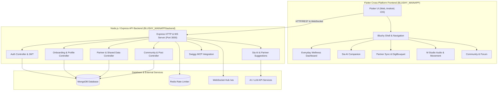

# 🌸 Blushy — Multi-Stage Women's Health & Wellness Platform

[](https://flutter.dev)
[](https://nodejs.org)
[](https://expressjs.com)
[](https://mongodb.com)
[](LICENSE)

**Blushy** is an adaptive, multi-stage women’s health, cycle-tracking, partner-sync, and AI-powered wellness ecosystem. Designed to support individuals across every phase of their hormonal journey—from first period through menopause—Blushy combines personalized physiological tracking, empathetic AI guidance, a supportive community, and partner synchronization.

---

## 🚀 Key Features & Functionality

### 1. 🩸 Adaptive Everyday Wellness Dashboard
Blushy dynamically reconfigures its UI, tracking metrics, and recommendations based on the user's active life stages:
* **First Period (Not Started)**: Puberty education, tracking early physical signs, and body positivity.
* **First Period (Started)**: Early menstrual tracking, symptom relief tips, and puberty guidance.
* **Living with My Cycle (Reproductive Years)**: 28-day cycle wheel visualization, follicular/ovulation/luteal phase tracking, daily mood check-ins, cramp severity, sleep quality, and energy correlations.
* **Trying to Conceive (TTC)**: Ovulation predictor, fertility windows, Basal Body Temperature (BBT) logging, and symptom mapping.
* **Pregnancy**: Trimester progress tracking, baby size milestones, maternal health check-ins, and trimester-specific guidance.
* **Postpartum**: Pelvic floor recovery tracking, lactation logs, emotional wellbeing check-ins, and sleep balance.
* **Perimenopause & Menopause**: Vasomotor symptom tracking (hot flashes, night sweats), hormone transition insights, and cardiovascular/bone health monitoring.
* **Hormonal Health Management**: Focused monitoring for condition management including PCOS, Endometriosis, and PMDD.

---

### 2. 🤖 Sia — Empathetic AI Health Assistant
* **AI Conversations**: Interactive, context-aware AI companion providing evidence-informed guidance on reproductive health, symptoms, and emotional wellbeing.
* **Voice Interaction**: Audio transcription and conversational voice queries.
* **Sia Insights**: Personalized, stage-specific daily health summaries rendered directly on the wellness dashboard.

---

### 3. 👥 Partner Sync & Partner Experience
* **Shared Health Data**: Connect with a partner to securely share cycle phases, mood trends, and sleep quality (with granular privacy controls).
* **AI Partner Suggestions**: Real-time actionable suggestions helping partners provide meaningful support (e.g., luteal phase comfort ideas, rest reminders, or cycle-aware nutrition).
* **DigiBouquet**: Virtual tokens of support, affection, and mood check-in flowers between partners.
* **Notifications**: Real-time alerts when important health events or partner check-ins occur.

---

### 4. 🎧 M Studio — Soundscapes & Movement
* **Audio Soundscapes**: Curated audio sessions for period relief, deep sleep, anxiety reduction, and focus.
* **Cycle-Synced Workouts**: Guided physical movement tailored to specific cycle phases (e.g., restorative yoga during menstruation, high-energy sessions in the follicular phase).
* **Breathing & Meditation**: Interactive breathwork timers and guided mindfulness sessions.

---

### 5. 💬 Blushy Community
* **Supportive Social Hub**: Safe space for users to post questions, share experiences, and support peers.
* **Category Filtering**: Explore topics across cycle health, TTC, pregnancy, menopause, and mental health.
* **Reddit Community Service Integration**: Aggregated, anonymized real-world health discussions and feeds.
* **Rich Interactions**: Post creation, comments, user profile sheets, and follow systems.

---

### 6. 👩‍👧 Parent Companion Hub
* Educational guides, conversation toolkits, and symptom tracking assistance for parents supporting young daughters navigating puberty and their first period.

---

### 7. 🛍️ Swiggy MCP Integration
* Hooks for food delivery, Instamart groceries, and Dineout (via Swiggy MCP) to enable cycle-synced nutrition, craving management, and emergency care package ordering.

---

## 🛠️ System Architecture



---

## 📂 Project Structure

```
Blushy/
├── BLUSHY_MAINAPP/
│   ├── lib/
│   │   ├── core/                  # Global state, themes, constants, and utilities
│   │   ├── features/
│   │   │   ├── auth/              # Authentication & Onboarding wizard flows
│   │   │   ├── home/              # Dashboard, stage handlers, and unified hero view
│   │   │   │   └── presentation/stages/
│   │   │   │       └── everyday_wellness_dashboard.dart
│   │   │   ├── sia/               # Sia AI chat & voice interface
│   │   │   ├── partner/           # Partner view, shared data cards, DigiBouquet
│   │   │   ├── m_studio/          # Audio soundscapes & cycle-synced movement studio
│   │   │   ├── community/         # Forum, post details, user profiles, create post
│   │   │   ├── parent/            # Parent support hub for puberty guidance
│   │   │   ├── journal/           # Symptom & daily wellness logging
│   │   │   └── legal/             # Privacy policies & terms of service
│   │   ├── models/                # Data models (Cycle, Partner, Community, SIA)
│   │   ├── services/              # API clients, auth storage, Reddit service
│   │   ├── shared/                # Bottom navigation, custom buttons, dialogs
│   │   └── main.dart              # Flutter application entrypoint
│   ├── backend/
│   │   ├── src/
│   │   │   ├── controllers/       # Express request handlers
│   │   │   ├── repositories/      # Data access layer for MongoDB
│   │   │   ├── routes/            # API Route definitions
│   │   │   ├── services/          # Business logic, schedulers & WebSocket hub
│   │   │   ├── middleware/        # JWT auth, rate limiting, security
│   │   │   ├── app.js             # Express app setup
│   │   │   └── server.js          # HTTP & WS server bootstrapper
│   │   └── package.json           # Node.js dependencies
│   └── pubspec.yaml               # Flutter configuration & dependencies
├── README.md                      # Primary documentation
└── AGENTS.md                      # Workspace developer rules
```

---

## ⚡ Getting Started

### Prerequisites
* **Flutter SDK**: Homebrew Cask installation (`flutter 3.44+`)
* **Node.js**: `v20+` and `npm`
* **MongoDB**: Running instance (Local or Atlas MongoDB URL in `.env`)

---

### 1. Setting Up & Running the Backend
```bash
cd BLUSHY_MAINAPP/backend

# Install Node dependencies
npm install

# Configure Environment
cp .env.example .env  # Update MONGODB_URI, JWT_SECRET, etc.

# Start Development Server
npm run dev
```
* The backend server will run on `http://localhost:3000` with WebSocket support at `ws://localhost:3000/ws`.

---

### 2. Setting Up & Running the Frontend Application

#### Web (Chrome):
```bash
cd BLUSHY_MAINAPP

# Fetch Flutter dependencies
flutter pub get

# Run on Chrome
flutter run -d chrome
```

#### Mobile (Android / iOS):
```bash
# Run on connected emulator or physical device
flutter run
```

---

## 📡 API Architecture Overview

| Endpoint | Method | Description |
| :--- | :--- | :--- |
| `/api/auth/register` | `POST` | User registration with email/password |
| `/api/auth/login` | `POST` | User login & JWT token issuance |
| `/api/onboarding/answers` | `POST` | Save life stage choices, DOB, symptoms, and goals |
| `/api/partner/invite` | `POST` | Send partner sync request |
| `/api/partner/shared-data` | `GET` | Retrieve authorized cycle, mood & sleep shared data |
| `/api/ai/partner-suggestions` | `GET` | Fetch AI suggestions tailored for partner support |
| `/api/ai/chat` | `POST` | Send message query to Sia AI assistant |
| `/api/posts` | `GET / POST` | Fetch community feed or publish a new post |
| `/api/posts/:id/comments` | `GET / POST` | Retrieve or add comments to a post |
| `/api/swiggy/recommendations`| `GET` | Get cycle-synced nutrition order recommendations |

---

## 🔒 Privacy & Security

* **Data Privacy**: Granular control over what health metrics (mood, cycle dates, symptoms) are shared with connected partners.
* **Authentication**: JWT-based stateless authorization headers.
* **Security Headers**: Helmet HTTP headers, rate limiting (Redis/Express), and sanitization.

---

## 📄 License

This project is proprietary and confidential. All rights reserved.